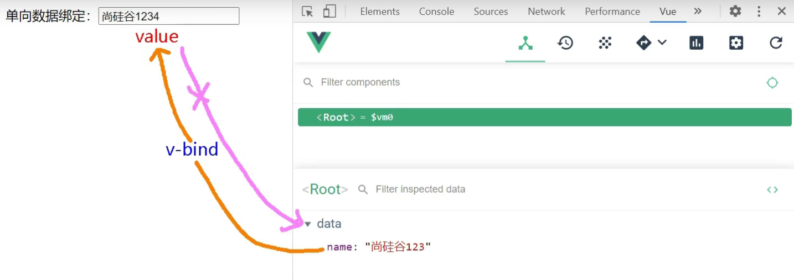
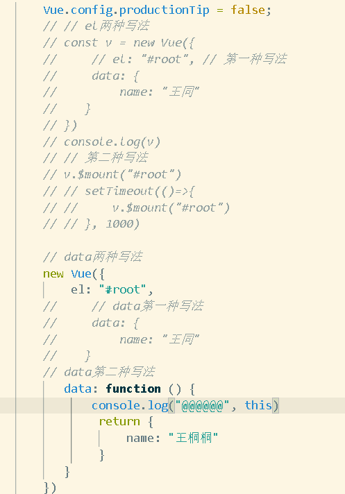
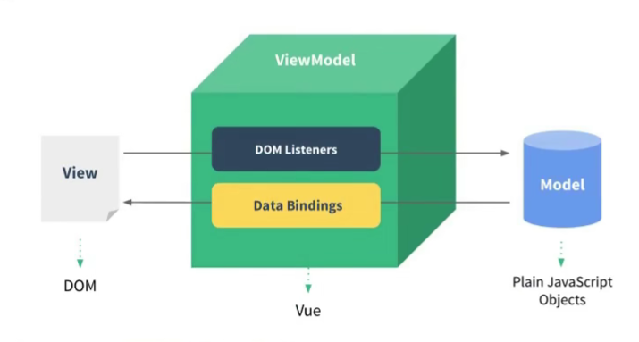
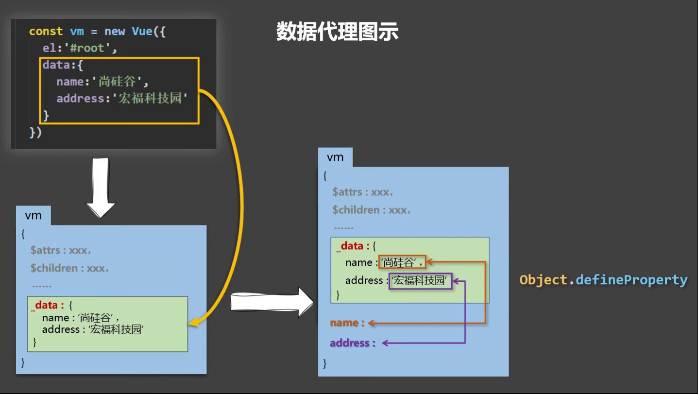
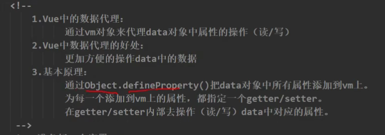
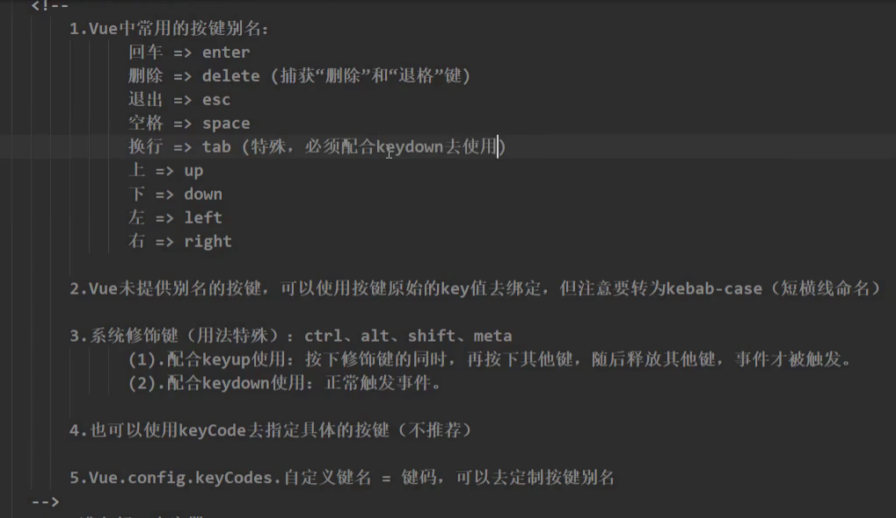
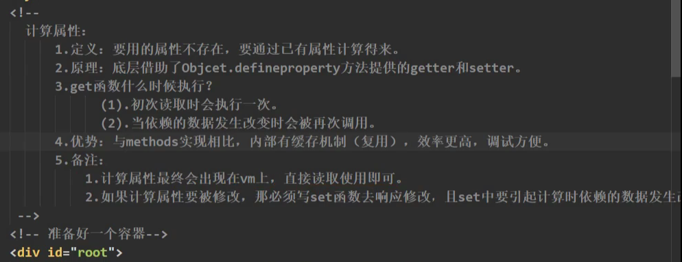

# Vue 学习

[TOC]

## 一、 去官网下载vue.js

## 二、 系统中有vscode


1. vscode 安装 vue 提示软件

> 当使用VSCode编写 .vue 文件时无代码片段提示时，装上 Vetur 和 Vue 2 Snippets 两个插件即可


三、快速代码命令

1. 快速创建 div

```vue
div#root
    <div id="root"></div>
```

2. 浏览器 shift+鼠标左键单击页面刷新键，强制刷新页面

## 第一章Vue核心

### 1.1. 初识Vue


### 1.2. 模板语法

### 1.2.1 效果

!


### 1.3.1数据绑定


>  v-bind 是单向绑定，input框修改，不会修改vue中的值



> v-model 双向绑定，数据变，data中的数据也变
>
> v-model 只能用在表单类元素上


1.3.2 el 和data的两种写法




### 1.4 MVVM模型

1. M: 模型（model）：对应data中的数据
2. V:视图（view）：模板
3. VM：视图模型（View Model）：Vue实例对象




### 1.5 数据代理





### 1.6.1 事件处理


### 1.6.2 事件修饰符


1.6.3 键盘事件修饰符



```text
1. 修饰符可以连续写
```

### 1.7 计算属性与监视

#### 1.7.1 效果


 

